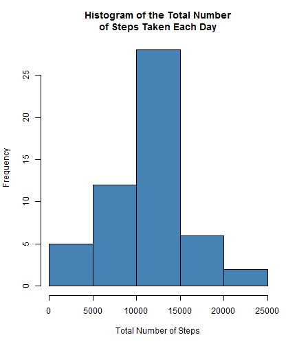
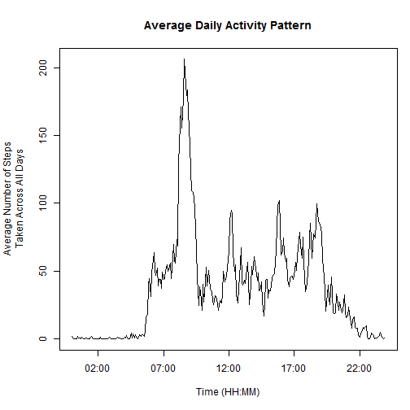
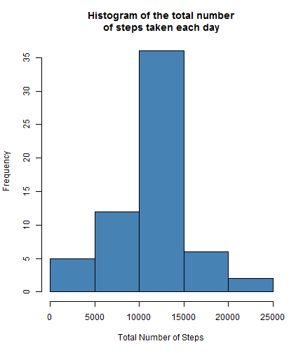
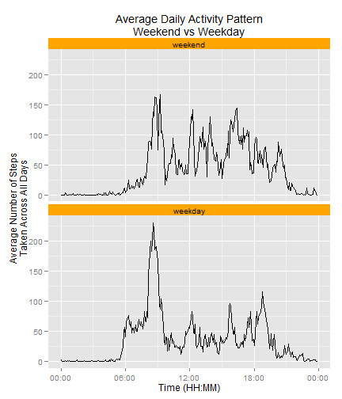

# Course Project 1
### Reproducible Research
### March 2015

<br>

## Introduction

Reproducible Research provides data scientists with a less robust alternative to validating scientific results where the inherent nature of the study makes it difficult to use replication.  Replication, the primary method of validating the results to a question of a study, requires investigators to collect their own data, perform their own analysis, and publish their findings.  Unfortunately, factors such as cost, time, etc. can inhibit the use of replication.  A secondary method, Reproducible Research - where the researcher makes analytic data and code available so that others may reproduce findings, permits a validation of the data analysis conducted to reach the conclusions of a study.  To become familiar with Reproducible Research, we will use literate statistical programming in the form of R Markdown and knitr to produce a human-readable document of a data analysis of a given dataset.

<br>

## The Raw Data

The dataset for this project is located in a zip file [here](https://d396qusza40orc.cloudfront.net/repdata%2Fdata%2Factivity.zip).  It is data from a personal activity monitoring device which collects data at 5-minute intervals throughout the day during the two months of October and November in 2012.  The variables included in this dataset are:

- **steps**:  Number of steps taken in a 5-minute interval (missing values are coded as NA)
- **date**:  The date on which the measurement was taken in YYYY-MM-DD format
- **interval**:  Identifier for the 5-minute interval in which measurement was taken

The dataset is stored in a comma-separated-value (CSV) file and there are a total of 17,568 observations in this dataset.

## Data Analysis

Download the zip file to your computer and unzip it to a directory.  This computer must have RStudio (Version 0.98.1091) installed.  Set the working directory of RStudio to the *repdata_data_activity* directory.  Load the *plyr*, *dplyr*, *ggplot2*, *scales*, and *knitr* libraries in RStudio.

According to the project instructions, the data analyses to perform are as follows:

1. Loading and preprocessing the data
2. What is mean total number of steps taken per day?
3. What is the average daily activity pattern?
4. Imputing missing values
5. Are there differences in activity patterns between weekdays and weekends?

<br>

#### *1. Loading and preprocessing the data*

Use the *read.csv()* function to load the csv file into R and change the *date* variable to a date type.


```r
raw_data <- read.csv("activity.csv")
data <- raw_data
data$date <- as.Date(strptime(data$date, "%Y-%m-%d"))
print(head(data, 8))
```

```
##   steps       date interval
## 1    NA 2012-10-01        0
## 2    NA 2012-10-01        5
## 3    NA 2012-10-01       10
## 4    NA 2012-10-01       15
## 5    NA 2012-10-01       20
## 6    NA 2012-10-01       25
## 7    NA 2012-10-01       30
## 8    NA 2012-10-01       35
```
<br>

#### *2. What is mean total number of steps taken per day?*

- 1. Calculate the total number of steps taken per day

Use the *ddply()* function to find the total number of steps taken per day.


```r
library(plyr, warn.conflicts = FALSE)
library(dplyr, warn.conflicts = FALSE)
```


```r
ans <- ddply(data, .(date), summarize, dailySteps = sum(steps))
print(head(ans, 5))
```

```
##         date dailySteps
## 1 2012-10-01         NA
## 2 2012-10-02        126
## 3 2012-10-03      11352
## 4 2012-10-04      12116
## 5 2012-10-05      13294
```
<br>

- 2. Make a histogram of the total number of steps taken each day

Use the *hist()* function to make the plot.


```r
hist(ans$dailySteps, col = "steelblue", main = "Histogram of the Total Number\nof Steps Taken Each Day", xlab = "Total Number of Steps")
```

 
<br>

- 3. Calculate and report the mean and median of the total number of steps taken per day

Use the *mean()* and *median()* functions with *na.rm=TRUE*.  The mean is **10766.19** and the median is **10765**.


```r
mean(ans$dailySteps, na.rm = TRUE)
```

```
## [1] 10766.19
```

```r
median(ans$dailySteps, na.rm = TRUE)
```

```
## [1] 10765
```
<br>

#### *3. What is the average daily activity pattern?*

- 1. Make a time series plot (i.e. type = "l") of the 5-minute interval (x-axis) and the average number of steps taken, averaged across all days (y-axis)

Use the *ddply()* function to calculate the average number of steps for each interval.  Convert the *interval* variable to a time format using the *strptime()* function.  Ignore the date in the *interval* variable since it is an arbitrary date.


```r
ans2 <- ddply(data, .(interval), summarize, aveStepsTaken = mean(steps, na.rm = TRUE))
data2 <- ans2
data2$interval <- strptime(sprintf("%04d", data2$interval), format = "%H%M")
print(head(data2, 8))
```

```
##              interval aveStepsTaken
## 1 2015-03-15 00:00:00     1.7169811
## 2 2015-03-15 00:05:00     0.3396226
## 3 2015-03-15 00:10:00     0.1320755
## 4 2015-03-15 00:15:00     0.1509434
## 5 2015-03-15 00:20:00     0.0754717
## 6 2015-03-15 00:25:00     2.0943396
## 7 2015-03-15 00:30:00     0.5283019
## 8 2015-03-15 00:35:00     0.8679245
```
Use the *plot()* function with adjusted margins to make the time series plot.


```r
par(mar = c(5.1, 5.1, 4.1, 1.1))
plot(data2$interval, data2$aveStepsTaken, type = "l", main = "Average Daily Activity Pattern", xlab = "Time (HH:MM)", ylab = "Average Number of Steps\nTaken Across All Days")
```

 
<br>

- 2. Which 5-minute interval, on average across all the days in the dataset, contains the maximum number of steps?

Use the *max()* function to find the interval with the maximum number of steps.  According to the output below, the maximum number of steps occurs at the **8:35** interval.


```r
data2[which(data2$aveStepsTaken == max(data2$aveStepsTaken)), "interval"]
```

```
## [1] "2015-03-15 08:35:00 PDT"
```
<br>

#### *4. Imputing missing values*

- 1. Calculate and report the total number of missing values in the dataset (i.e. the total number of rows with NAs)

Use the *sum()* and *complete.cases()* functions to determine the number of rows with missing values.  The number of rows with missing values is **2304**.


```r
data3 <- data
sum(!complete.cases(data3))
```

```
## [1] 2304
```
<br>

- 2. Devise a strategy for filling in all of the missing values in the dataset. The strategy does not need to be sophisticated. For example, you could use the mean/median for that day, or the mean for that 5-minute interval, etc.

We will use the mean for the 5-minute interval calculated from part 3-1, the data in **ans2**.  Below is the data table with NAs still present.


```r
print(head(data3, 8))
```

```
##   steps       date interval
## 1    NA 2012-10-01        0
## 2    NA 2012-10-01        5
## 3    NA 2012-10-01       10
## 4    NA 2012-10-01       15
## 5    NA 2012-10-01       20
## 6    NA 2012-10-01       25
## 7    NA 2012-10-01       30
## 8    NA 2012-10-01       35
```
<br>

- 3. Create a new dataset that is equal to the original dataset but with the missing data filled in.

Below is the same table with the NAs replaced with the means of the intervals.


```r
temp <- rep(round(ans2$aveStepsTaken), 61)
data3$steps[which(is.na(data3$steps))] <- temp[which(is.na(data3$steps))]
print(head(data3, 8))
```

```
##   steps       date interval
## 1     2 2012-10-01        0
## 2     0 2012-10-01        5
## 3     0 2012-10-01       10
## 4     0 2012-10-01       15
## 5     0 2012-10-01       20
## 6     2 2012-10-01       25
## 7     1 2012-10-01       30
## 8     1 2012-10-01       35
```
<br>

- 4. Make a histogram of the total number of steps taken each day.  Calculate and report the mean and median total number of steps taken per day. Do these values differ from the estimates from the first part of the assignment? What is the impact of imputing missing data on the estimates of the total daily number of steps?

Use the *hist()* function to make the plot.  With the NAs values filled in the dataset, the mean is **10765.64** and the median is **10762**.  These new values differ slightly from the values reported in step 2-3.  Therefore, there is not much of an impact of imputing missing data on a dataset of this size.


```r
ans3 <- ddply(data3, .(date), summarize, dailySteps = sum(steps))
hist(ans3$dailySteps, col = "steelblue", main = "Histogram of the total number\nof steps taken each day", xlab = "Total Number of Steps")
```

 


```r
mean(ans3$dailySteps)
```

```
## [1] 10765.64
```

```r
median(ans3$dailySteps)
```

```
## [1] 10762
```
<br>

#### *5. Are there differences in activity patterns between weekdays and weekends?*

- 1. Create a new factor variable in the dataset with two levels - "weekday" and "weekend" indicating whether a given date is a weekday or weekend day.

Use the *mutate()* function to add two new variables to the dataset - a *day* variable for the day of the week and a *typeOfDay* variable to indicate weekday or weekend.  A '0' corresponds to a weekend and a '1' corresponds to a weekday.  The factor labels will change the *typeOfDay* accordingly.


```r
data4 <- data3
data4 <- mutate(data4, day = weekdays(data4$date))
data4 <- mutate(data4, typeOfDay = 0)
for(i in 1:length(data4$date)) {
     if(data4$day[i] == "Saturday" | data4$day[i] == "Sunday") {
     } else {
          data4$typeOfDay[i] = 1
     }
}
data4$typeOfDay <- factor(data4$typeOfDay, labels = c("weekend", "weekday"))
print(head(data4, 3))
```

```
##   steps       date interval    day typeOfDay
## 1     2 2012-10-01        0 Monday   weekday
## 2     0 2012-10-01        5 Monday   weekday
## 3     0 2012-10-01       10 Monday   weekday
```

```r
print(data4[1441:1443, ])
```

```
##      steps       date interval      day typeOfDay
## 1441     0 2012-10-06        0 Saturday   weekend
## 1442     0 2012-10-06        5 Saturday   weekend
## 1443     0 2012-10-06       10 Saturday   weekend
```
<br>

- 2. Make a panel plot containing a time series plot (i.e. type = "l") of the 5-minute interval (x-axis) and the average number of steps taken, averaged across all weekday days or weekend days (y-axis). See the README file in the GitHub repository to see an example of what this plot should look like using simulated data.

Use the *ddply()* function to calculate the average number of steps for each interval.  Convert the *interval* variable to time with the *strptime()* function.  Make the plot with ggplot2 using facets.  Fix the x-axis tick labels with the *scales* library.


```r
ans4 <- ddply(data4, .(interval, typeOfDay), summarize, aveStepsTaken = mean(steps))
data5 <- ans4
data5$interval <- strptime(sprintf("%04d", data5$interval), format = "%H%M")
```


```r
library(ggplot2)
library(scales)
p <- ggplot(data5, aes(interval, aveStepsTaken))
p + geom_line() + 
     facet_wrap(~typeOfDay, ncol = 1, nrow = 2) + 
     scale_x_datetime(labels = date_format("%H:%M")) +
     theme(strip.background = element_rect(fill = "orange")) +
     xlab("Time (HH:MM)") +
     ylab("Average Number of Steps\nTaken Across All Days") +
     ggtitle("Average Daily Activity Pattern\nWeekend vs Weekday")
```

 
<br>

## Conclusion

The mean/median of the total number of steps taken per day did not change much from when the 2304 NA rows were stripped before computation in part 2-3 to when the NA rows were filled in with the mean values for the intervals from part 4-4.  Thus for a small dataset where the number of NA rows is about 13% of the total number of observations ((2304/17,568) * 100), the NAs do not have much of an effect on the mean/median.  Refer to the table below.

|             |    mean|median|
|:------------|:-------|:-----|
|NAs stripped |10766.19| 10765|
|NAs filled in|10765.64| 10762|

The histograms and the daily activity plot show that on most days, the subject of the study takes between 10,000-15,000 steps per day with the most activity at the 8:35 time interval.  

The daily activity plot comparing weekdays to weekends indicate the subject is more active throughout the day on the weekends.  This might suggest the subject has a desk job during the weekdays.
